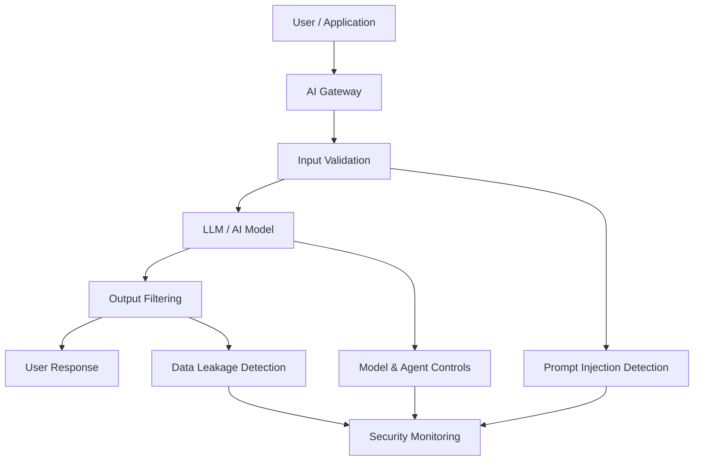

# 🤖 AI Security Lab
Practical experiments and research exploring AI security, LLM threats, prompt injection and secure AI system design.

  
  
  
  
  

A practical lab exploring security risks in Artificial Intelligence and Large Language Model (LLM) systems.

## 🔍 Overview

This repository contains practical experiments, demonstrations and research relating to the security of AI systems.

Areas explored include:

- Prompt injection
- LLM security
- AI agent security
- Data and model security
- Adversarial attacks
- Secure AI architecture
- AI threat modelling
- AI security controls and mitigations

## 🎯 Objectives

## 🏗️ AI Security Architecture

The aim of this lab is to explore how AI systems can be designed, tested and deployed securely while understanding emerging threats against increasingly capable AI systems.

## 🚧 Project Status

This project is under active development. Practical AI security labs, architecture examples and security testing demonstrations will be added progressively.
